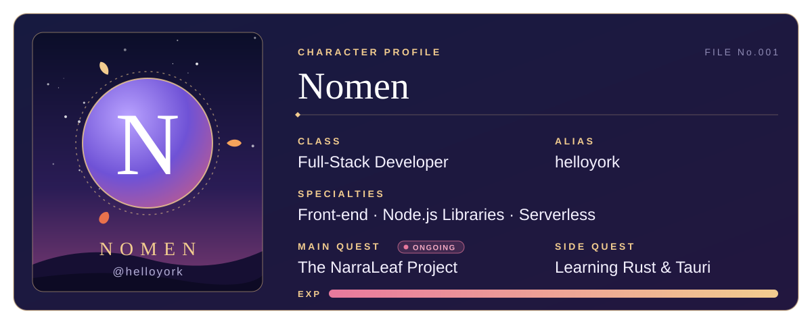

— What will you say? —

 
 

 

 

<b>📜 Item list (plain text)</b>

 

| Category | Items |
| :-- | :-- |
| Languages | TypeScript · JavaScript · HTML · CSS · Rust *(learning)* |
| Frameworks & Runtime | React · Next.js · Svelte · Node.js · Tailwind CSS |
| Cloud & Serverless | Google Cloud · Azure · Laf · Kaggle |
| APIs & Data | RESTful · WebSocket · GraphQL · SQL · ORM |
| Build Tooling | Webpack · esbuild · Babel |
| Quality & CI | Git · GitHub Actions · ESLint · Husky · CodeQL · Jest |
| Desktop & Automation | Electron · Tauri *(learning)* · Puppeteer |

 

  

✦ ACHIEVEMENT UNLOCKED ✦

  

<a href="#top">▲ Return to Title</a>

